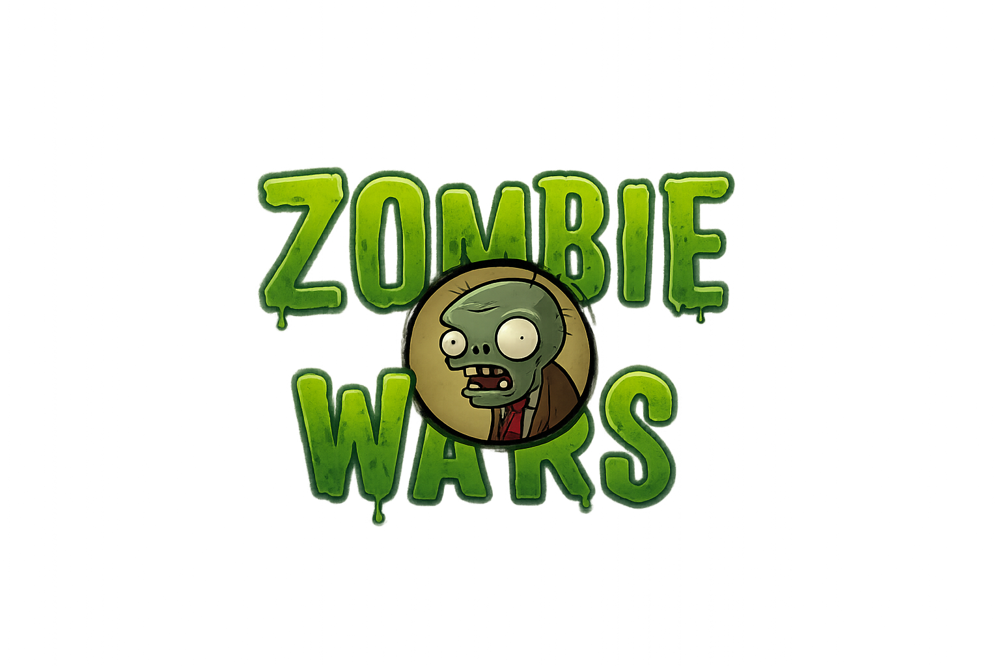
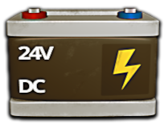
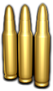
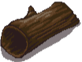
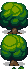

# csc413-zombiegame


| Student Information |                 |
|:-------------------:|-----------------|
|  Student Name       | Roxana del Toro |
|  Student Email      | rxdt@sfsu.edu   |


## Purpose of jar Folder 
The jar folder will store the built jar `jar/tankgame-rxdt.jar`

`THIS FOLDER CAN NOT BE DELETED OR MOVED`

# Required Information when Submitting Tank Game

## Version of Java Used: 24.0.1

## IDE used: 
### IntelliJ IDEA 2025.1.2 (Ultimate Edition) on Macbook Pro

## Steps to Import project into IDE:
`git clone git@github.com:csc413-SFSU-SU2025/tankgame-rxdt.git`

## Steps to Manually Build Project:
```
>  cd tankgame-rxdt
>  mkdir -p out
>  javac -d out $(find ZombieGame/src -name "*.java")
>  cp -r ZombieGame/resources/* out/
```
## Steps to Build the JAR
```
>  mkdir -p jar
>  jar cfm jar/tankgame-rxdt.jar manifest.txt -C out .
```
## Steps to Run Project:
```
>  java -cp out zombiegame.Launcher
```
## Alternate steps to run the project - run the JAR directly
```
>  java -jar jar/tankgame-rxdt.jar
```

## Controls to play Zombie Wars:

|               | Player 1 - Green | Player 2 - Red |
|---------------|------------------|----------------|
|  Forward      | W                | up arrow       |
|  Backward     | S                | down arrow     |
|  Rotate left  | A                | left arrow     |
|  Rotate Right | D                | right arrow    |
|  Shoot        | space            | enter          |

## Power Ups
#### HEALTH
Eat a brain and gain 35 health points <br>
 

#### SHIELD
Pick up a shield and become invincible to an opponent's bullets <br>
 

#### SPEED
3X your speed with a battery boost <br>
 

#### LASER BEAMS
Damage your opponent even more with laser ammo!<br>


## Breakable Walls - Flowers 


## Non-breakable Walls - Trees and Shrubs


## Extra!
####
If you don't move your zombie for more than 30 seconds it will grumble and start breathing heavily.
#### Secret Code
Green Zombie 1 Easter Egg `W W S S A D A D B A`<br>
Red Zombie 2 Easter Egg `↑ ↑ ↓ ↓ ← → ← → B A`